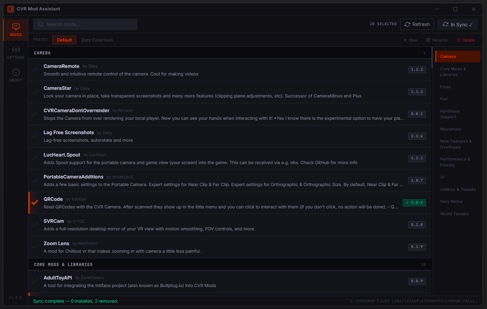
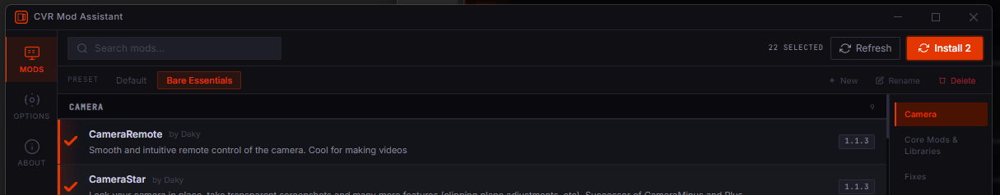
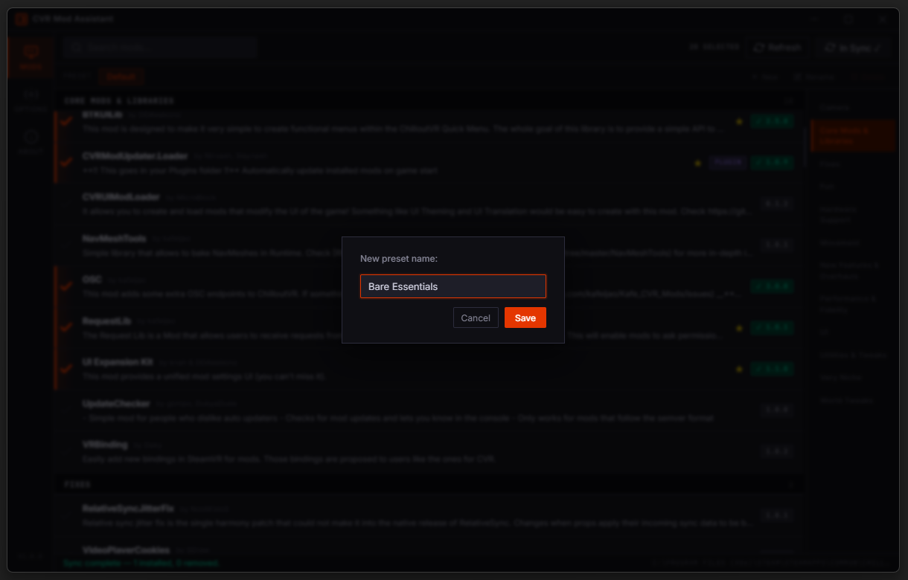

# CVR Mod Assistant

This project was developed with the assistance of AI, originally as a personal tool created out of a desire for a specialized presets feature. While it started out of boredom and just for fun, I decided to share it on GitHub in case others might also find the mod presets and management features useful.

A modern, fast, and beautiful mod manager for [ChilloutVR](https://store.steampowered.com/app/661130/ChilloutVR/).



## Features

- **Clean and Intuitive Interface**: Designed for ease of use with a focus on readability and smooth navigation.
- **Mod Management**: Browse, install, update, and remove mods from the CVRmg community with ease.
- **Sync Support**: One-click synchronization to keep your local mods up to date.

## Presets

Manage different mod configurations effortlessly with the new Presets feature. Create, rename, and switch between presets for different playstyles or testing environments.




## Installation

Download the latest `CVRModAssistant.exe` from [Releases](https://github.com/LensError/CVRModAssistant/releases) and run it. No installation required.

## Building from source

Requires [Node.js](https://nodejs.org/).

```
npm install
npm run build
```

Output is placed in `dist/`.

## Credits

This project was built upon the foundations of [CVRMelonAssistant](https://github.com/Nirv-git/CVRMelonAssistant). This rewrite would not have been possible without the excellent work done by [Nirv-git](https://github.com/Nirv-git) and the original contributors.

> [!IMPORTANT]
> **Disclaimer**: Modding ChilloutVR is [officially allowed](https://docs.chilloutvr.net/official/legal/tos/#7-modding-our-games) per the ChilloutVR Terms of Service. However, **CVR Mod Assistant is NOT affiliated with and/or endorsed by the ChilloutVR Team.** Use this tool at your own risk.

## License

This project is licensed under the [MIT License](LICENSE).
